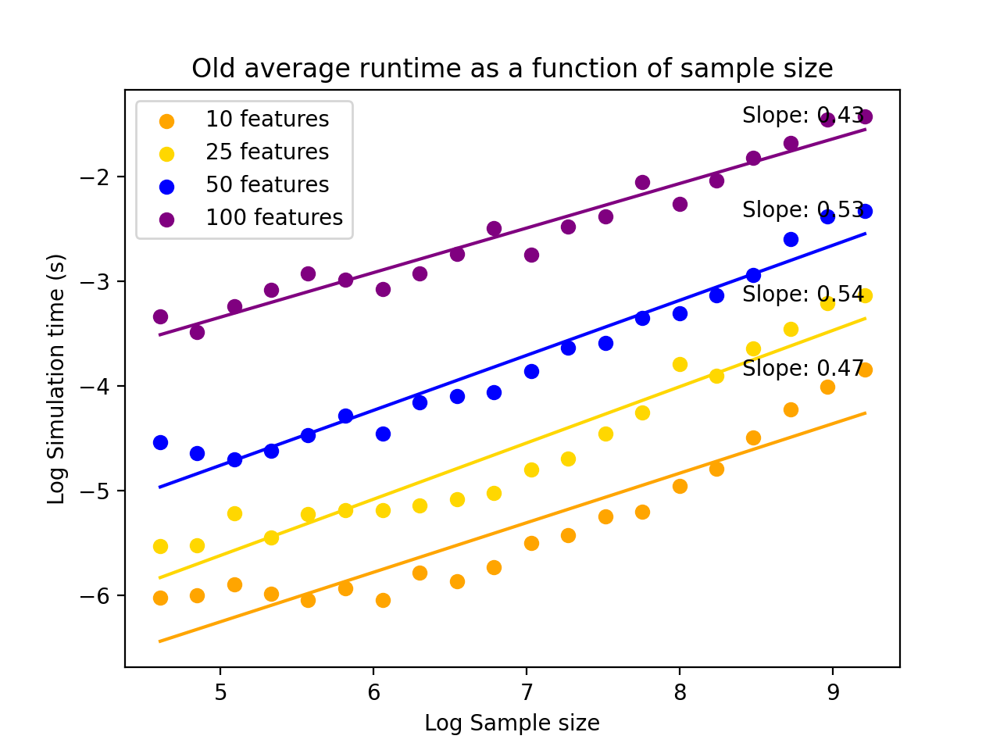
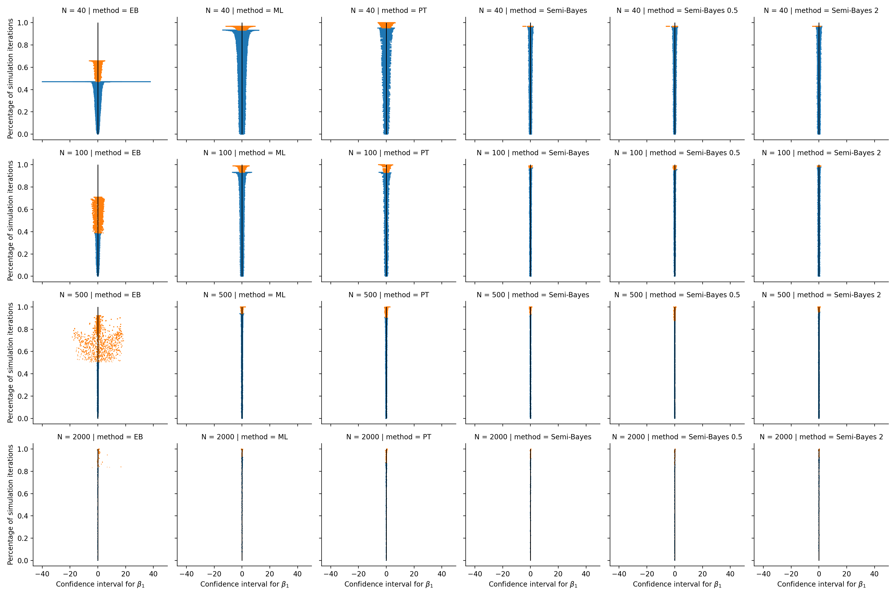

## Baseline Simulation Performance

Using the original version of the code, the full simulation run took a total of 137.837 seconds.
The main bottleneck was with the estimation code, which took 124.248 seconds. This consists of 
four estimation methods: mle (54.0907 s), preliminary_testing (33.1887 s),
empirical_bayes (32.1547 s), and semi_bayes (4.82403 s). For mle and preliminary_testing (which calls mle),
the main bottleneck was fitting the logistic regression model using statsmodels.GLM. 
For the empirical bayes estimates, the primary bottleneck was repeated matrix inversions in the iterative algorithm
for estimating tau^2^. Line-by-line profiling results for these functions are available at the end of the document.

The computational complexity for the simulation appeared to scale at O(√n), where n is the sample size.
This is visible from the plot below, which shows the estimated slope of the curves on log-log scale is around 0.5.
Thus, log(time) = 0.5*log(n) implies time $\propto$ √n, for a fixed number of features.

## Baseline Stability Analysis
Running the simulation also generates warnings. There were 55 warnings generated total. 8 of these were perfect
separation warnings, indicating an issue with the model, and the rest were numerical issues relating to overflow,
dividing by zero, or invalid values in multiplication and square roots. These warnings are all likely connected
to each other, resulting from occasional unstable MLE fits.

This instability may have had downstream effects with the empirical Bayes estimation. The zipper plot below shows
extreme deviation in the empirical Bayes estimates, especially for when the sample size was 500. This could also
be due to instability in the empirical Bayes computations, but no warnings were thrown from this code. 

## Baseline Key Profiling Results

|Name | Result|
|---------|---------|
|Total time:| 54.0907 s|
|File: |profiling/baseline_profile.py|
|Function: |mle at line 272|

|Line #   |   Hits   |      Time  Per Hit |  % Time | Line Contents|
|---------|----------|--------------------|---------|--------------|
|   272   |          |                    |         | @profile|
|   273   |          |                    |         | def mle(y, X):|
|   274   |          |                    |         |     """ |
|   275   |          |                    |         |         Fit logistic regression model via maximum likelihood and |return coefficients
|   276   |          |                    |         | |
|   277   |          |                    |         |     Parameters|
|   278   |          |                    |         |     ----------|
|   279   |          |                    |         |     X : array-like|
|   280   |          |                    |         |         Matrix of predictors|
|   281   |          |                    |         |     y : array-like|
|   282   |          |                    |         |         Vector of responses|
|   283   |          |                    |         | |
|   284   |          |                    |         |     Returns|
|   285   |          |                    |         |     -------|
|   286   |          |                    |         |     ml_coefs : array|
|   287   |          |                    |         |         Maximum likelihood coefficients for beta|
|   288   |          |                    |         |     ml_cov : array|
|   289   |          |                    |         |         Inverse of the observed information matrix|
|   290   |          |                    |         |     """|
|   291   |  32500   | 7810551.0    240.3 |    14.4 |     model = sm.GLM(y, X, family=sm.families.Binomial())|
|   292   |  32500   |42375878.0   1303.9 |    78.3 |     model_results = model.fit()|
|   293   |  32500   |  260168.0      8.0 |     0.5 |     ml_coefs = model_results.params|
|   294   |  32500   | 3034981.0     93.4 |     5.6 |     information_matrix = -model.hessian(ml_coefs)|
|   295   |  32500   |   15906.0      0.5 |     0.0 |     try:|
|   296   |  32500   |  576379.0     17.7 |     1.1 |         ml_cov = np.linalg.inv(information_matrix)|
|   297   |     10   |       2.0      0.2 |     0.0 |     except:|
|   298   |     10   |      31.0      3.1 |     0.0 |         ml_cov = np.zeros(np.shape(information_matrix))|
|   299   |          |                    |         |    |
|   300   |  32500   |   16772.0      0.5 |     0.0 |     return ml_coefs, ml_cov|

|Name | Result|
|---------|---------|
|Total time:| 32.1547 s|
|File: |profiling/baseline_profile.py|
|Function: |empirical_bayes at line 325|

|Line #   |   Hits   |      Time  Per Hit |  % Time | Line Contents|
|---------|----------|--------------------|---------|--------------|
|   325   |          |                    |         | @profile|
|   326   |          |                    |         | def empirical_bayes(y, X, ml_coefs, ml_cov, tol=1e-8, max_iter=100):|
|   327   |          |                    |         |     """|
|   328   |          |                    |         |         Compute empirical bayes estimate beta_hat and its |covariance.|
|   329   |          |                    |         | |
|   330   |          |                    |         |     Parameters|
|   331   |          |                    |         |     ----------|
|   332   |          |                    |         |     y : array-like|
|   333   |          |                    |         |         Vector of responses|
|   334   |          |                    |         |     X : array-like|
|   335   |          |                    |         |         Design matrix|
|   336   |          |                    |         |     ml_coefs : array-like|
|   337   |          |                    |         |         Maximum likelihood estimate of beta|
|   338   |          |                    |         |     ml_cov : array_like|
|   339   |          |                    |         |         Inverse of observed information matrix at beta|
|   340   |          |                    |         |     tol : float, optional|
|   341   |          |                    |         |         Convergence tolerance for method of moments estimation.|
|   342   |          |                    |         |         Default is 1e-8.|
|   343   |          |                    |         |     max_iter : int, optional|
|   344   |          |                    |         |         Maximum number of iterations for method of moments estimation|.
|   345   |          |                    |         |         Default is 100.|
|   346   |          |                    |         | |
|   347   |          |                    |         |     Returns|
|   348   |          |                    |         |     -------|
|   349   |          |                    |         |     beta_hat : array_like|
|   350   |          |                    |         |         Empirical bayes estimate of beta|
|   351   |          |                    |         |     covb : array_like|
|   352   |          |                    |         |         Estimated covariance matrix of beta_hat|
|   353   |          |                    |         |     tau2 : float|
|   354   |          |                    |         |         Estimate of tau^2|
|   355   |          |                    |         |     """|
|   356   |  19590   |   37524.0      1.9 |     0.1 |     n = np.size(X, axis=1)|
|   357   |  19590   |    6130.0      0.3 |     0.0 |     p = 1|
|   358   |  19590   |    4834.0      0.2 |     0.0 |     Vhat = ml_cov|
|   359   |  19590   |   56314.0      2.9 |     0.2 |     Z = np.ones((n,1))|
|   360   |          |                    |         | |
|   361   |          |                    |         |     # Initial guess for tau^2 is 0, (see ref 9 in paper) repeat until convergence|
|   362   |  19590   |    4433.0      0.2 |     0.0 |     tau2 = 0|
|   363   |  19590   |    5744.0      0.3 |     0.0 |     n_iter = 0|
|   364   |  19590   |    4332.0      0.2 |     0.0 |     converge = 1|
|   365   | 508942   |  151021.0      0.3 |     0.5 |     while(converge > tol and n_iter < max_iter):|
|   366   | 499961   |11035124.0     22.1 |    34.3 |         W = np.linalg.inv(Vhat + tau2*np.identity(n))|
|   367   | 499961   | 8374426.0     16.8 |    26.0 |         pi_hat = np.linalg.inv(Z.T@W@Z)@Z.T@W@ml_coefs|
|   368   | 499961   |  416942.0      0.8 |     1.3 |         mu_hat = Z@pi_hat|
|   369   | 499961   |  273044.0      0.5 |     0.8 |         e = ml_coefs - mu_hat|
|   370   | 499961   | 3125752.0      6.3 |     9.7 |         R = e.T@W@e/np.sum(W)|
|   371   | 499961   | 4983004.0     10.0 |    15.5 |         Vbar = np.sum(W@Vhat)/np.sum(W)|
|   372   | 499961   |  209903.0      0.4 |     0.7 |         tau_new = n/(n-p)*R-Vbar|
|   373   | 499961   |  138203.0      0.3 |     0.4 |         if tau_new < 0:|
|   374   |  10609   |    2968.0      0.3 |     0.0 |             tau_new = 0 # Variance estimate cannot be negative|
|   375   |  10609   |    2839.0      0.3 |     0.0 |             break|
|   376   | 489352   |  164984.0      0.3 |     0.5 |         converge = abs(tau2-tau_new)|
|   377   | 489352   |  126569.0      0.3 |     0.4 |         n_iter = n_iter + 1|
|   378   | 489352   |  112346.0      0.2 |     0.3 |         tau2 = tau_new|
|   379   |          |                    |         | |
|   380   |          |                    |         |     # Recompute with final tau2|
|   381   |  19590   |  434094.0     22.2 |     1.4 |     W = np.linalg.inv(Vhat + tau2*np.identity(n))|
|   382   |  19590   |  330685.0     16.9 |     1.0 |     pi_hat = np.linalg.inv(Z.T@W@Z)@Z.T@W@ml_coefs|
|   383   |  19590   |   16909.0      0.9 |     0.1 |     mu_hat = Z@pi_hat|
|   384   |  19590   |   11101.0      0.6 |     0.0 |     e = ml_coefs - mu_hat|
|   385   |  19590   |  123684.0      6.3 |     0.4 |     R = e.T@W@e/np.sum(W)|
|   386   |  19590   |  197163.0     10.1 |     0.6 |     Vbar = np.sum(W@Vhat)/np.sum(W)|
|   387   |          |                    |         |     |
|   388   |  19590   |  342884.0     17.5 |     1.1 |     H = Z@np.linalg.inv(Z.T@W@Z)@Z.T@W|
|   389   |  19590   |  134639.0      6.9 |     0.4 |     T = tau2*np.identity(n)|
|   390   |  19590   |   32364.0      1.7 |     0.1 |     Vstar = (n-p-2)*Vhat/(n-p)|
|   391   |  19590   |   18587.0      0.9 |     0.1 |     Tstar = T + Vhat - Vstar|
|   392   |  19590   |   59533.0      3.0 |     0.2 |     G = W@(Vstar@H@W+Tstar)|
|   393   |  19590   |   19345.0      1.0 |     0.1 |     beta_hat = G@ml_coefs|
|   394   |          |                    |         | |
|   395   |  19590   |   25407.0      1.3 |     0.1 |     B = (n-2-p)/(n-p)*W*Vhat|
|   396   |          |                    |         |     #beta_hat = B@(np.ones(n))*mu_hat + (np.identity(n)-B)@ml_coefs|
|   397   |          |                    |         | |
|   398   |          |                    |         | |
|   399   |  19590   |  350605.0     17.9 |     1.1 |     H = Z@np.linalg.inv(Z.T@W@Z)@Z.T@W|
|   400   |  19590   |  131726.0      6.7 |     0.4 |     A = 2/(n-p)*B@np.outer(e, e)@B.T|
|   401   |  19590   |  139640.0      7.1 |     0.4 |     Vbar = W@Vhat/np.sum(W)|
|   402   |          |                    |         | |
|   403   |  19590   |   11135.0      0.6 |     0.0 |     covb = np.zeros(n)|
|   404   | 179490   |   53516.0      0.3 |     0.2 |     for i in range(n):|
|   405   | 319800   |  297561.0      0.9 |     0.9 |         covb[i] = (Vhat[i,i] - (1-H[i,i])*(Vhat@B)[i,i] + |
|   406   | 159900   |   90589.0      0.6 |     0.3 |         (Vbar[i,i] + tau2)*W[i,i]*A[i,i])|
|   407   | 159900   |   76431.0      0.5 |     0.2 |         covb[i] = max(0, covb[i]) # Set to 0 if variance is negative|
|   408   |          |                    |         | |
|   409   |  19590   |   20650.0      1.1 |     0.1 |     return beta_hat, covb, tau2|

|Name | Result|
|---------|---------|
|Total time:| 4.82403 s|
|File: |profiling/baseline_profile.py|
|Function: |semi_bayes at line 411|

|Line #   |   Hits   |      Time  Per Hit |  % Time | Line Contents|
|---------|----------|--------------------|---------|--------------|
|   411   |          |                    |         | @profile|
|   412   |          |                    |         | def semi_bayes(y, X, ml_coefs, ml_cov, tau_guess):|
|   413   |          |                    |         |     """|
|   414   |          |                    |         |         Compute Semi-Bayes estimate beta_hat and its covariance.|
|   415   |          |                    |         | |
|   416   |          |                    |         |     Parameters|
|   417   |          |                    |         |     ----------|
|   418   |          |                    |         |     y : array-like|
|   419   |          |                    |         |         Vector of responses|
|   420   |          |                    |         |     X : array-like|
|   421   |          |                    |         |         Design matrix|
|   422   |          |                    |         |     ml_coefs : array-like|
|   423   |          |                    |         |         Maximum likelihood estimate of beta|
|   424   |          |                    |         |     ml_cov : array_like|
|   425   |          |                    |         |         Inverse of observed information matrix at beta|
|   426   |          |                    |         |     tau_guess : float|
|   427   |          |                    |         |         Assumed prior of tau^2, the variance of the stage II random| errors
|   428   |          |                    |         | |
|   429   |          |                    |         |     Returns|
|   430   |          |                    |         |     -------|
|   431   |          |                    |         |     beta_hat : array_like|
|   432   |          |                    |         |         Semi-bayes estimate of beta|
|   433   |          |                    |         |     covb : array_like|
|   434   |          |                    |         |         Estimated covariance matrix of beta_hat|
|   435   |          |                    |         |     """|
|   436   |  58770   |   98111.0      1.7 |     2.0 |     n = np.size(X, axis=1)|
|   437   |  58770   |   14606.0      0.2 |     0.3 |     p = 1|
|   438   |  58770   |   13916.0      0.2 |     0.3 |     Vhat = ml_cov|
|   439   |  58770   |  630590.0     10.7 |    13.1 |     mu_hat = np.mean(ml_coefs)|
|   440   |          |                    |         | |
|   441   |  58770   | 1326959.0     22.6 |    27.5 |     W = np.linalg.inv(Vhat + tau_guess*np.identity(n))|
|   442   |  58770   |   66393.0      1.1 |     1.4 |     B = W@Vhat|
|   443   |  58770   |  644388.0     11.0 |    13.4 |     beta_hat = B@np.ones(n)*mu_hat + (np.identity(n)-B)@ml_coefs|
|   444   |          |                    |         | |
|   445   |          |                    |         |     # Compute covariance estimate with adjustment|
|   446   |  58770   |  143320.0      2.4 |     3.0 |     Z = np.ones((n,1))|
|   447   |  58770   | 1028203.0     17.5 |    21.3 |     H = Z@np.linalg.inv(Z.T@W@Z)@Z.T@W|
|   448   |          |                    |         |     |
|   449   |  58770   |   26700.0      0.5 |     0.6 |     covb = np.zeros(n)|
|   450   | 538470   |  151618.0      0.3 |     3.1 |     for i in range(n):|
|   451   | 479700   |  648103.0      1.4 |    13.4 |         covb[i] = Vhat[i,i] - (1-H[i,i])*(Vhat@B)[i,i]|
|   452   |          |                    |         | |
|   453   |  58770   |   31124.0      0.5 |     0.6 |     return beta_hat, covb|

|Name | Result|
|---------|---------|
|Total time:| 33.1887 s|
|File: |profiling/baseline_profile.py|
|Function: |preliminary_testing at line 455|

|Line #   |   Hits   |      Time  Per Hit |  % Time | Line Contents|
|---------|----------|--------------------|---------|--------------|
|   455   |          |                    |         | @profile|
|   456   |          |                    |         | def preliminary_testing(y, X, ml_coefs, ml_covs, alpha=0.10):|
|   457   |          |                    |         |     """|
|   458   |          |                    |         |         Compute estimate of beta via maximum likelihood with subset selection |
|   459   |          |                    |         | |
|   460   |          |                    |         |     Parameters|
|   461   |          |                    |         |     ----------|
|   462   |          |                    |         |     y : array-like|
|   463   |          |                    |         |         Vector of responses|
|   464   |          |                    |         |     X : array-like|
|   465   |          |                    |         |         Design matrix|
|   466   |          |                    |         |     ml_coefs : array-like|
|   467   |          |                    |         |         Maximum likelihood estimate of beta|
|   468   |          |                    |         |     ml_cov : array_like|
|   469   |          |                    |         |         Inverse of observed information matrix at beta|
|   470   |          |                    |         |     alpha : float|
|   471   |          |                    |         |         Threshold for selecting covariates.|
|   472   |          |                    |         | |
|   473   |          |                    |         |     Returns|
|   474   |          |                    |         |     -------|
|   475   |          |                    |         |     beta_hat : array_like|
|   476   |          |                    |         |         Semi-bayes estimate of beta|
|   477   |          |                    |         |     beta_cov : array_like|
|   478   |          |                    |         |         Diagonal of inverse of observed information matrix from the full model,|
|   479   |          |                    |         |         evaluated at beta_hat|
|   480   |          |                    |         |     """|
|   481   |  19590   |   31568.0      1.6 |     0.1 |     n = np.size(X, axis=1)|
|   482   |  19590   |    9174.0      0.5 |     0.0 |     keep = [False]*n|
|   483   |          |                    |         | |
|   484   |          |                    |         |     # Determine which covariates to retain|
|   485   | 179490   |   52319.0      0.3 |     0.2 |     for i in range(n):|
|   486   | 159900   |  148412.0      0.9 |     0.4 |         t = ml_coefs[i]/np.sqrt(ml_covs[i,i])|
|   487   | 159900   | 8496905.0     53.1 |    25.6 |         keep[i] = 2*(1-norm.cdf(abs(t))) <= alpha|
|   488   |          |                    |         | |
|   489   |          |                    |         |     # If nothing selected, return nothing|
|   490   |  19590   |  138130.0      7.1 |     0.4 |     if(not np.any(keep)):|
|   491   |   6690   |    4486.0      0.7 |     0.0 |         return [None]*n, [None]*n|
|   492   |          |                    |         | |
|   493   |          |                    |         |     # Compute new estimates|
|   494   |  12900   |   43660.0      3.4 |     0.1 |     Xnew = X[:,keep]|
|   495   |  12900   |19276455.0   1494.3 |    58.1 |     b_hat, b_cov = mle(y, Xnew)|
|   496   |  12900   |    6916.0      0.5 |     0.0 |     beta_hat = np.zeros(n)|
|   497   |  12900   |   24822.0      1.9 |     0.1 |     beta_hat[keep] = b_hat|
|   498   |          |                    |         | |
|   499   |          |                    |         |     # Update covariance estimate to use hessian from original model|
|   500   |  12900   | 3396422.0    263.3 |    10.2 |     og_model = sm.GLM(y, X, family=sm.families.Binomial())|
|   501   |  12900   | 1246315.0     96.6 |     3.8 |     information_matrix = -og_model.hessian(beta_hat)|
|   502   |  12900   |  303888.0     23.6 |     0.9 |     beta_cov = np.diag(np.linalg.inv(information_matrix))|
|   503   |          |                    |         | |
|   504   |  12900   |    9236.0      0.7 |     0.0 |     return beta_hat, beta_cov|

