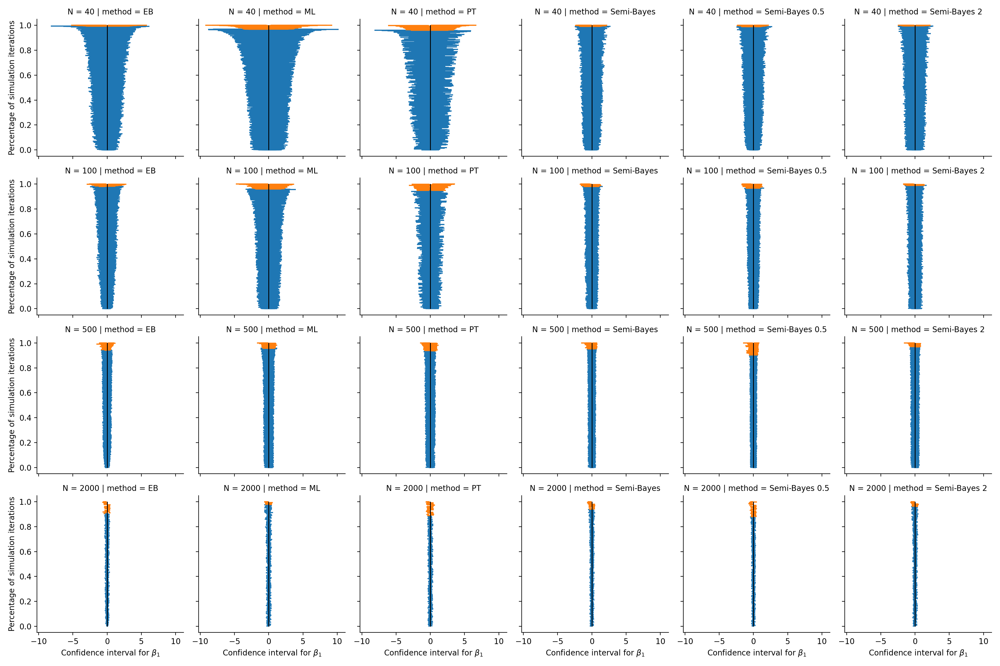
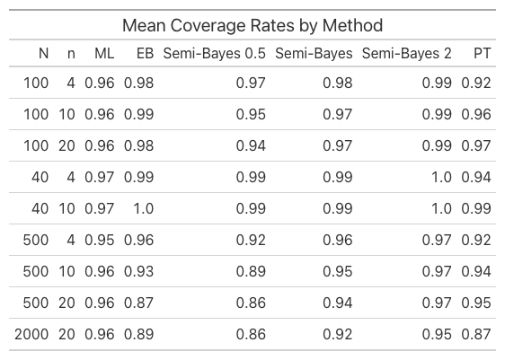
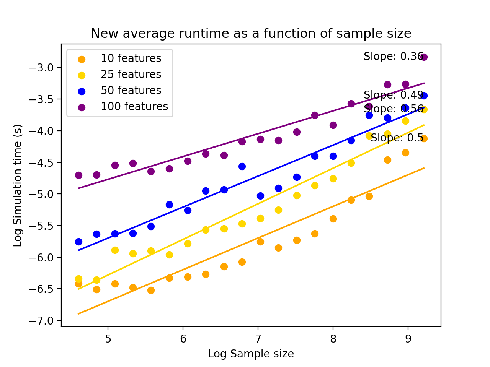

## Optimized Simulation Performance Summary
Profiling the baseline simulation revealed computational bottlenecks and stability issues with the simulation methods.
Ensuring stable maximum likelihood and empirical Bayes fits were of primary importance, since the baseline simulation
completed in about 2 minutes. However, the optimized code also resulted in a slight speedup, with the simulation running
in 80.9792 seconds instead of 137.84 seconds. The optimized code did result in more stable fits, as demonstrated in the 
following zipper plot. The MLE and empirical Bayes confidence intervals exhibit coverage rates much closer to the nominal 95%.



## Code Improvements
Code improvements were implemented for all four methods (logistic_irls, empirical_bayes, semi_bayes, and preliminary_testing).
The changes included implementing array programming practices where possible, as well as
updating slow and unstable matrix operations for faster versions in several cases.

### MLE / Logistic IRLS
In the baseline simulation, the mle function was used for maximum likelihood estimation, which relied
on the statsmodels package for fitting GLMs with IRLS. In the updated version, IRLS algorithm was written
from scratch instead (named logistic_irls). 

As the name implies, IRLS requires repeatedly solving different weighted least squares problems.
The update is typically written in the form $(X^\top W X)^{-1} X^\top (y-\mu)$. However,
since $W$ is a diagonal matrix, it is not necessary to form the full matrix and the multiplication
can be efficiently computed using broadcasting. The weighted least squares problem can then be
recast as solving a system of linear equations, which further speeds up computation. Both of these
techniques were implemented in the code, as shown below. Note that Z represents the design matrix 
in this case and s is the vector of square root weights.
```
 s = np.sqrt(mu*(1-mu))
 ZS = Z*s[:, np.newaxis]
 update = np.linalg.solve(ZS.T@ZS, Z.T@(y-mu))
 beta_new = beta + step_size*update
```

The profiling results showed that using this function was faster than the earlier mle function. 
The total time spent with logistic_irls was 32.278 seconds as opposed to 54.0907 seconds with the
mle. However, the statsmodels fit function provides other functionality than simply computing the
mle and its covariance, so it is possible that the speedup is mostly explained by eliminating
unnecessary computations.

### Empirical Bayes
The empirical Bayes algorithm is also an iterative procedure, and the improvements to this
algorithm primarily consisted of rewriting the matrix computations in a manner which allowed
for easy updating. This appears to also have led to improvements in the stability of the resulting estimates,
as shown earlier.

At each iteration step, the baseline code computed an inverse of the form $W = (\hat{V} + \tau^2 I)^{-1}$,
where $\hat{V}$ is the covariance matrix of $\hat{\beta}$ from the MLE. However, this inversion can be
dramatically simplified. Since $\hat{V}$ is a diagonalizable matrix, it can be decomposed via
eigendecomposition as $QDQ^\top$. Then, using the Woodbury matrix formula, the earlier matrix inversion
can be written as $W = \frac{1}{\tau^2}(I- \frac{1}{\tau^2}Q(D^{-1} + \frac{1}{\tau^2}I)^{-1}Q^\top)$. Although
this form appears to be more complicated, the bulk of this computation can be done once using the
eigendecomposition and updates for new $\tau^2$ values can be implemented via vectorization.

The code was also updated to provide more efficient computation in the special case that $\tau^2 = 0$,
and a for loop was replaced with a broadcasted version when computing the variance estimates.
Below are the relevant portions of the old and optimized versions of the code.

Old code:
```
W = np.linalg.inv(Vhat + tau2*np.identity(n))
pi_hat = np.linalg.inv(Z.T@W@Z)@Z.T@W@ml_coefs
mu_hat = Z@pi_hat
e = ml_coefs - mu_hat
R = e.T@W@e/np.sum(W)
Vbar = np.sum(W@Vhat)/np.sum(W)

...

for i in range(n):
    covb[i] = (Vhat[i,i] - (1-H[i,i])*(Vhat@B)[i,i] + 
    (Vbar[i,i] + tau2)*W[i,i]*A[i,i])
    covb[i] = max(0, covb[i]) # Set to 0 if variance is negative
```

New code:
```
eigen, eigenvectors = np.linalg.eig(Vhat)
d1 = 1/eigen
Q = np.vstack(eigenvectors)
while(converge > tol and n_iter < max_iter):
    if tau2 == 0:
            W = Q@np.diag(d1)@Q.T
            Vnum = n
    else:
        W = (np.eye(n)-Q@np.diag(1/(d1+1/tau2))@Q.T/tau2)/tau2
        Vnum = np.sum(W@Vhat)

    e = ml_coefs - Z@np.linalg.inv(Z.T@W@Z)@Z.T@W@ml_coefs
    denom = np.sum(W)
    R = e.T@W@e/denom
    Vbar = Vnum / denom

...

covb = np.diag(Vhat) - (1-h)*vb + (np.diag(Vbar)+tau2)*np.diag(W)*a
covb[covb < 0] = 0
```

These improvements led to a new profiled time of 16.0701 seconds instead of 32.1547 seconds. As mentioned
previously, the results were also much more stable than before.

### Semi-Bayes
Although the semi_bayes function was not a main bottleneck (since it is not an iterative algorithm),
a small improvement was made by replacing a for loop with broadcasted operations for the variance
estimation, as done with empirical_bayes. This led to a profiling time of 4.49262 seconds instead of 4.82403 seconds.

Old code:
```
for i in range(n):
    covb[i] = Vhat[i,i] - (1-H[i,i])*(Vhat@B)[i,i]
```

New code:
```
covb = np.diag(ml_cov) - (1-np.diag(H))*np.diag(ml_cov@B)
```

### Preliminary Testing
The primary improvement to the preliminary testing algorithm was due to improvements from
logistic_irls, since this function also performs maximum likelihood estimation. However,
improvements were made by using vectorization to replace a for loop, and also by avoiding
multiple calls to statsmodels.GLM in order to compute the covariance matrix.

Old code:
```
for i in range(n):
    t = ml_coefs[i]/np.sqrt(ml_covs[i,i])
    keep[i] = 2*(1-norm.cdf(abs(t))) <= alpha

...

og_model = sm.GLM(y, X, family=sm.families.Binomial())
information_matrix = -og_model.hessian(beta_hat)
beta_cov = np.diag(np.linalg.inv(information_matrix))
```

New code:
```
t = ml_coefs / np.sqrt(np.diag(ml_covs))
keep = 2*(1-norm.cdf(abs(t))) <= alpha

...

mu = 1/(1+np.exp(-X@beta_hat))
s = np.sqrt(mu*(1-mu))
XS = X*s[:,np.newaxis]
beta_cov = np.diag(np.linalg.inv(XS.T@XS))
```

This led to a new profiled time of 12.3736 seconds instead of 33.1887 seconds.

## Algorithmic Correctness
Although the results do not match those from the baseline simulation, it is clear that the
stability improvements also led to more accurate results. This was demonstrated in the
zipper plot, but this is also evident from a table of the mean coverage rates as well.



The table shows that MLE coverage was close to the nominal level 95%. The other methods appeared to
be more susceptible to overcoverage and undercoverage, depending on the sample size. However, the
coverage rates were still within a reasonable distance from the nominal level.

Additionally, a test was implemented in tests/regression_test.py which computes the Euclidean distance
of the MLE coefficients to the true values of $\beta$. The test is based off of a concentration bound
given in Chardon, Lerasle, Mourtada (2024), equation 11. Since the bound is only guaranteed to hold with
high probability, occasionally the test will fail. However, in the vast majority of cases the test
passes.

Given these results, the algorithmic improvements appear to have both improved the speed and stability
of the estimation without sacrificing accuracy.

## Empirical Complexity

As before, we examine the empirical time complexity of the estimation procedures, given in the plot below.
The slope estimates are comparable to those in the baseline simulation, at around 0.5. This indicates
that the overall estimation does not inherently scale better than the baseline code. However, the points
are all shifted down by about 1 unit on the log scale, reflecting the x2 speedup observed in the profiling.



## Lessons Learned

Overall, the most useful improvement were the updates to the empirical bayes code. Although it took
some time to figure out how to reformulate the matrix inversion for easier updating, the end result
was not only faster than the baseline but yielded much more stable results. I am not sure exactly what
part of the code resulted in unstable estimates, but it seems that simplifying the matrix inversions
reduced error accumulation from floating point operations, especially for $\tau^2$ estimates close
to 0. Due to these improvements, the simulation results are much more interpretable and reasonable
than before.

Making improvements to the MLE code was a good learning experience, but even though it was the 
largest bottleneck in the code I think that the gains from optimizing this function were relatively
minor, since the scaling behavior remained the same across both versions. However, this did make
the simulation about twice as fast, which was helpful when debugging code for other parts of 
the project, such as the complexity analysis.